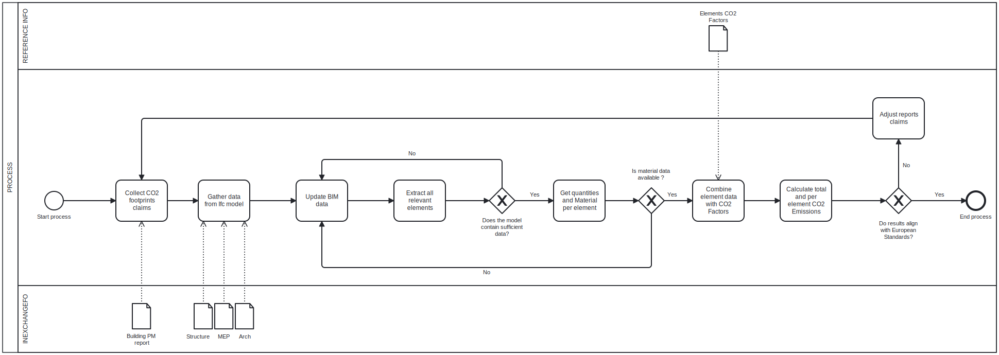
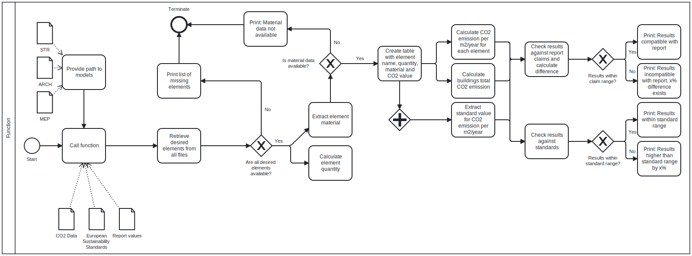

# Group 04, Assignment 2
## 2A
> I'm confident coding in phyton 

As managers, our priority is to ensure that the CO2 emissions for each building element are accurately calculated and remain compliant with the EN15978 standard.

## 2B
We have chosen to work with the report and building from #2406. Our work involves analysing the life cycle environmental impacts of materials (i.e. CO2 emissions) for each element used for construction. By calculating CO2 emissions, we aim to compare the carbon footprint of every building element with the benchmarks and guidelines set by EN15978. The calculations are also checked against claims made on page 20 in the report. 

## 2C 
- **How you would check this claim?**

By first checking IFC model to ensure that the building elements(walls, floors, windows, etc.) and their material are available in the IFC model. If so, we calculate their CO2 emissions and use data for CO2 emission standards (i.e. EN15978) as well as claims made in the report to compare and verify the results.

- **When would this claim need to be checked?**

The claim regarding the compliance of CO2 emissions per building element with the EN15978 standard should ideally be checked at multiple stages during the building lifecycle to ensure that sustainability goals are met. However, it is critical for the claims to be checked early on to prevent costly changes in later stages.  

- **What information does this claim rely on?** 

EN15978 standard, claims made in the report and model data.

- **What phase? planning, design, build or operation.**

Design phase. Early design decisions have the biggest influence on the building's life cycle CO2 emissions, as they lock in the majority of the carbon impact.

- **What BIM purpose is required? Gather, generate, analyse, communicate or realise?**  

Each of these BIM purposes plays a role in achieving compliance with EN15978, but the most important purpose would be Analyse, as it directly relates to evaluating and verifying the building’s CO2.

### Potential use cases 

- **Sustainability Analysis** 

#### Description

A process to evaluate and track the sustainability performance of a facility by using a sustainability metric system, e.g., LEED, Green Globes, etc. This process should occur during all stages of a facilities life including planning, design, construction, and operation. Applying sustainable features to a project in the planning and early design phases is more effective (ability to impact design) and efficient (cost and schedule of decisions). This comprehensive process requires more disciplines to interact earlier by providing valuable insights. This integration may require contractual integration in planning phase. In addition to achieving sustainable goals, having LEED approval process adds certain calculations, documentations, and verifications. Energy simulations, calculations, and documentations can be performed within an integrative environment when responsibilities are well defined and clearly shared.

 
- BPMN Diagram is [here](Main-Diagram.bpmn)

## 2D

- **Identify where a new script / function / tool is needed.**

The areas in green are where our tool is used.

## 2E

- **Describe in words your idea for your own OpenBIM ifcOpenShell Tool in Python.**

The tool should calculate the total CO2 emissions, as well as the emissions per element, and check if they comply with the EU standards and the claims made in the building report.

- **What is the business and societal value of your tool?**

From a business perspective, it is essential to have a quick way of estimating the sustainability metrics in early stages as it would have a direct impact on the design and choice of material. The ability to quickly and easily calculate resulting CO2 emissions encourages constructors to build more environment-friendly buildings, resulting in cleaner cities.

Produce a BPMN diagram to summarise your idea.
- The diagram of the code idea is [here](Function-process.bpmn)

## 2F

- **Identify what information you need to extract from the model.**

We need to extract all element types, their materials, quantities and dimensions from the IFC model.

- **Where is this in IFC?**

The following is needed from the architectural , structural and MEP model:

    - IfcElement
    - IfcQuantity
    - IfcMaterial

- **Is it in the model?**

Ideally, the above is expeected to be found in the model.

- **Do you know how to get it in ifcOpenShell?**

Not yet, we need to explore further. 

- **What will you need to learn to do this?**

We need to learn to get relevant information needed from the Ifc model using ifcOpenShell. 

## 2G

- **What software licence will you choose for your project?**

Visual Studio Code

