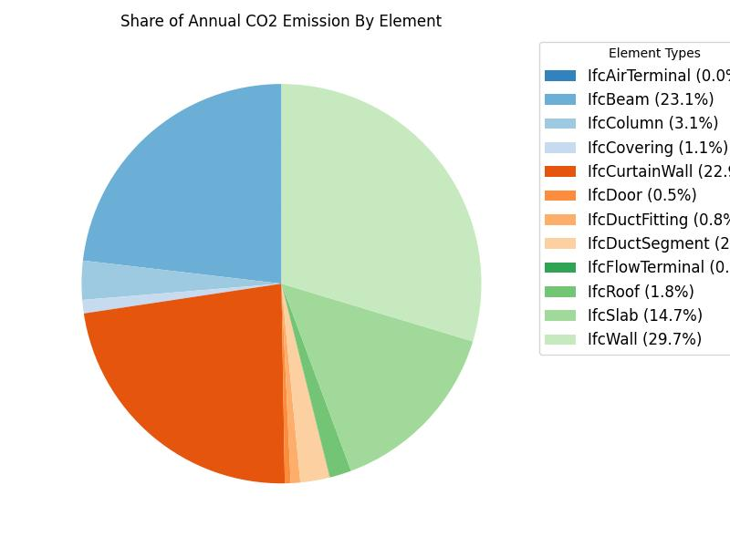
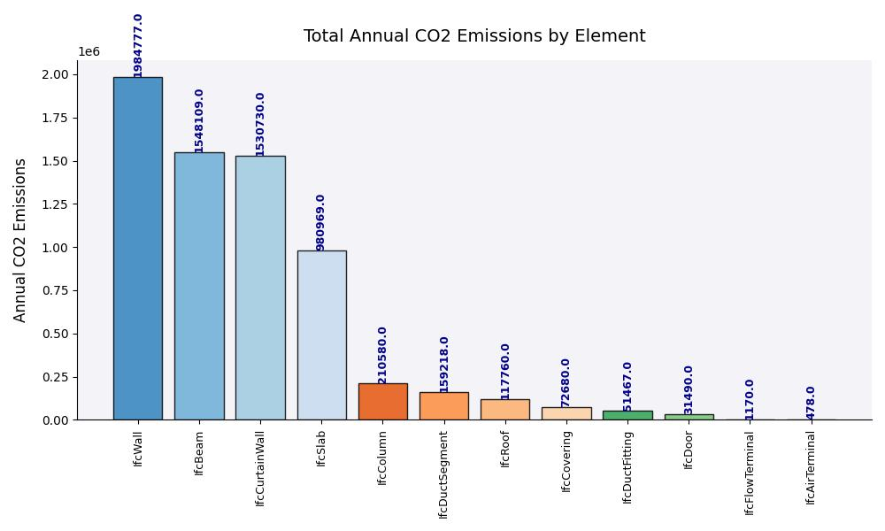

# About the tool and the problem

 Reporting CO2 footprint in a construction project involves great effort by the Project Manager discipline to manually collect data from other disciplines as well as external sources. This process can be time consuming and heavily relies on information gathered at later stages of construction. Having the ability to obtain this information programmaticially from IFC files and estimating CO2 emission early on is essential in guiding choice of material. 
 
 Therefore, we have developed a tool that calculates and visualises the total and per element annual CO2 emission of a building using a combination of information extracted from IFC files and external material and CO2 data. The tool uses object-oriented python and IfcOpenShell library to solve this problem.  

# Description of the tool

The tool is a python class that is constructed using the input IFC files along with several methods that help process, calculate and visualise the results. We have specifically decided to use an object-oriented approach to make usage of the tool simpler for the client. A procedure the tool takes can be briefly described as follows:

>1.	Import and load the architectural, structural and MEP models
>2.	Take the subset of building elements (i.e. IfcAirTerminal, IfcBeam, IfcColumn, IfcCovering, IfcCurtainWall, etc) as input from the user to perform analysis on.
>3.	For each element, extract information on the following attributes:
> - Element subtype: (e.g. external wall, air terminal, etc)
> -	Quantity attributes: length, area, volume
> - Material (if available)
>4.	Process and clean material data as extracted material data can be long and contain redundant information. For instance, a wall with multiple layers can have material information related to each layer. This requires further processing to have a standard and clean material data.
>5.	Put results into a dataframe to simplify subsequent processing and calculations
>6.	Import external data on annual CO2 emissions and join with the dataframe. The data is in JSON format and contains information about annual CO2 emission per length, area and volume for each element. 
>7.	For each element, calculate annual CO2 emission per volume (m3) unit.
>8.	Plot the results as line and pie chart. The line chart shows total CO2 emission per element and the pie chart compares the contribution of each element to the CO2 footprint. A helper method also exists to save the plots instead of just showing to be used in external reports.  


# Instructions to run the tool

The main model is constructed by simply providing the path to the architectural, structural and MEP IFC files. The client then needs to provide the list of desired IFC elements in order to start the information extraction. Consequently, the methods described above should be called sequentially to obtain and visualise the results. A snippet of the tool usage:   

```
def calculate_results():
    script_dir = Path(__file__).parent.resolve()
    dir_path = "PATH_TO_MODEL_DIRECTORY"
    arc_path = "ARC.ifc"
    str_path = "STR.ifc"
    mep_path = "MEP.ifc"

    model = ModelWithEstimator(dir_path, arc_path, str_path, mep_path)
    building_element_types = [
    "IfcWall", "IfcSlab", "IfcColumn", "IfcBeam", "IfcDoor", "IfcWindow",
    "IfcStair", "IfcRoof", "IfcCovering", "IfcCurtainWall",
    "IfcFlowSegment", "IfcPipeSegment", "IfcPipeFitting",
    "IfcDuctSegment", "IfcDuctFitting", "IfcFan", "IfcFlowTerminal"
    ]

    model.extract_element_data(building_element_types)
    material_path = script_dir / "assumed_materials.json"
    with open(material_path, 'r') as file:
        assumed = json.load(file)

    model.impute_materials(assumed)

    co2_path = script_dir / "co2_data.json"
    with open(co2_path, 'r') as co2_file:
        co2_data = json.load(co2_file)

    model.calculate_co2(co2_data)

    return model


if __name__ == '__main__':
    results = calculate_results()
    results.show_total_element_co2()
    results.show_total_co2()
    results.show_co2_for_element(['IfcBeam'])
    #results.generate_plots()
    results.plot_results()

```

Below is a sample result




### What information is required in the model for your tool to work?

IFC files often lack material information to a large extent (in this case about 80 percent) and the available information can contain invalid information. Hence, there were assumptions made about the materials for the majority of elements which can naturally lead to less accuracy in the final results. The CO2 emission data is imported from an external source. However, in our case, this data was curated to fit with the data extracted from the models in order to reach a clean output. 

In a more realistic scenario, there should be methods in place that can programmatically extract and process this data to make the tool more flexible. 


### Which subjects might use it?
The main target group for this tool is the PM discipline.  

### What Advanced Building Design Stage (A,B,C or D) would your tool be usefuL?

The tool should ideally be used in stage C, where the subject reports and information about the building are being prepared for the client.


